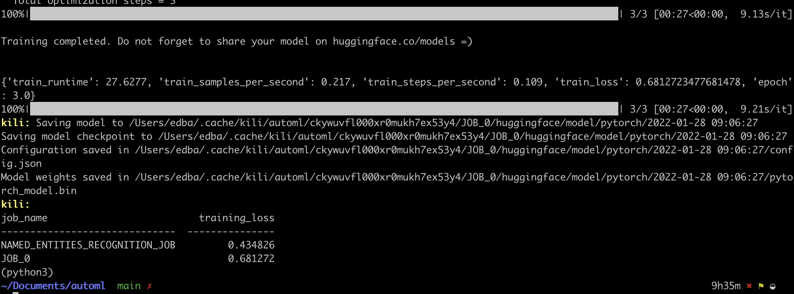
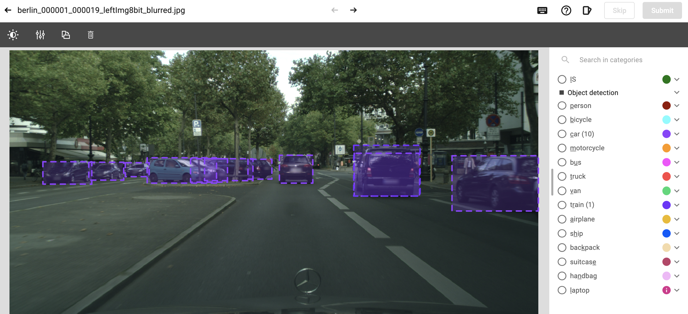
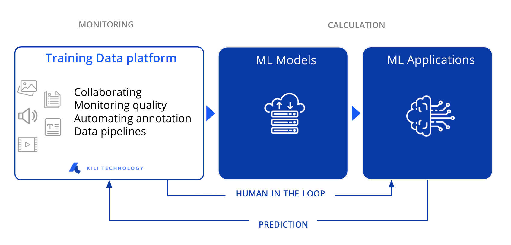

# Kili AutoML

AutoML is a lightweight library to create ML models in a data-centric AI way:

1. Label on [Kili](https://www.kili-technology.com)
2. **Train** a model with AutoML and evaluate its performance in one line of code
3. **Push** predictions to [Kili](https://www.kili-technology.com) to accelerate the labeling in one line of code

Iterate.

Once you are satisfied with the performance, in one line of code, **serve** the model and monitor the performance keeping human in the loop with [Kili](https://www.kili-technology.com).

## Installation

```bash
git clone https://github.com/kili-technology/automl.git
cd automl
pip install -r requirements.txt
```

## Usage

AutoML is made to be very simple to use. The main methods are:

### Train a model

```bash
python train.py \
    --api-key $KILI_API_KEY \
    --project-id $KILI_PROJECT_ID
```

Retrieve the annotated data from the project and specialize the best model among the following ones on each task:

- Hugging Face (text classification and NER)
- spaCy (coming soon)
- YOLOv5 (coming soon)
- Simple Transformers (coming soon)
- Catalyst (coming soon)
- XGBoost & LightGBM (coming soon)

Compute model loss to infer when you can stop labeling.



### Push predictions to Kili (coming soon)

```bash
python predict.py \
    --api-key $KILI_API_KEY \
    --project-id $KILI_PROJECT_ID
```

Use trained models to push pre-annotations onto unlabeled assets. Typically speeds up labeling by 10% with each iteration.



### Serve a model (coming soon)

```bash
python serve.py \
    --api-key $KILI_API_KEY \
    --project-id $KILI_PROJECT_ID
```

Serve trained models while pushing assets and predictions to [Kili](https://www.kili-technology.com) for continuous labeling. Allows to monitor the model drift.



## Disclaimer

AutoML is a utility library that trains and serves models. It is your responsibility to determine whether the performance of the model make it usable or not.

Don't hesitate to contribute!
